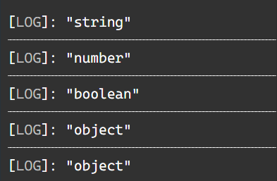
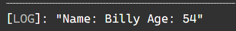
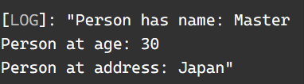
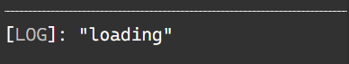
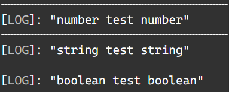
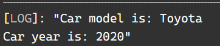

#### <div align="end">Вайцеховський Олександр ІПЗ 3-02</div>
### <div align="center">Лабораторне заняття №1</div>
#### Тема: Ознайомлення з TypeScript
#### Мета: Ознайомитися з основами мови TypeScript шляхом виконання практичних завдань, що демонструють базові можливості мови: типізацію, інтерфейси, класи, композитні типи та дженерики.

#### Хід роботи:
##### 1. Типізація змінних
		1) Оголосіть змінні наступних типів: string, number, boolean, array, object.
		
		```typescript
		let stringExample   :   string;
		stringExample   =   "test";
		let numberExample   :   number;
		numberExample   =   0;
		let booleanExample  :   boolean;
		booleanExample  =   false;
		let arrayExample    =   [];
		arrayExample = ['0','1',]
		let objectExample   =   {};
		
		console.log(typeof stringExample);
		console.log(typeof numberExample);
		console.log(typeof booleanExample);
		console.log(typeof arrayExample);
		console.log(typeof objectExample);
		```
		
		
		
		2)Створіть функцію, яка приймає як аргумент об'єкт із полями name (тип string) та age (тип number) і повертає рядок виду: "Name: John, Age: 30".
		
		```typescript
		class Person {
			name: string;
			age: number;
 
			constructor(name: string, age: number) {
			this.name = name;
			this.age = age;
			}
		}
		
		function toString(obj:  Person)
		{
			return  "Name: " + obj.name + " Age: " + obj.age;
		}

		let person = new Person("Billy", 54);
		console.log(toString(person));
		```
		
		
		
##### 2. Інтерфейси
		1) Оголосіть інтерфейс Person, який містить поля:
			name: string
			age: number
			address?: string (опціональне поле)
			
		```typescript
		interface Person
		{
			name: string;
			age: number;
			address: string;
		}
		
		let dude: Person = {
			name: 'Master',
			age: 30,
			address: 'Japan',
		};
		```
		2) Реалізуйте функцію printPerson, яка приймає об'єкт типу Person та виводить його дані у консоль.
		
		```typescript
		function printPerson(individual: Person)
		{
			console.log(
			'Person has name: ' + individual.name + '\n'
			+ 'Person at age: ' + individual.age + '\n'
			+ 'Person at address: ' + individual.address
			);
		}
		
		printPerson(dude);
		```
		
		
		
##### 3. Композитні типи
		1) Оголосіть об'єднаний тип (union type), наприклад: 

		type Status = 'success' | 'error' | 'loading';
		
		```typescript
		type Status = 'success' | 'error' | 'loading';
		```

		2) Реалізуйте конструкцію (наприклад, функцію або умову), яка виводить повідомлення відповідно до значення Status.
		
		```typescript
		let temp : Status;
		temp = 'loading';

		if (true)
		{
			console.log(temp)
		}
		```
		
		
		
##### 4. Дженерики
		1)Реалізуйте функцію identity<T>(value: T): T, яка повертає передане їй значення.
		
		```typescript
		function identity<T>(value: T): T
		{
			return value;
		}
		```
		
		2)Використайте її для типів number, string та boolean.
		
		```typescript
		console.log('number test ' + typeof identity(5));
		console.log('string test ' + typeof identity('test'));
		console.log('boolean test ' + typeof identity(true));
		```
		
		
		
##### 5. Класи
		1) Реалізуйте клас Car, який містить поля:
			model: string
			year: number
			
		```typescript
		class Car {
			model: string;
			year: number;

			constructor(model: string, year: number) {
				this.model = model;
				this.year = year;
			}
		}
		```
		2) Додайте метод getCarInfo(), який повертає рядок виду: "Model: Toyota, Year: 2020".
		
		```typescript
		class Car {
			model: string;
			year: number;

			constructor(model: string, year: number) {
			this.model = model;
			this.year = year;
		}
    
			getCarInfo()
			{
				console.log(
					'Car model is: ' + this.model + '\n'
					+ 'Car year is: ' + this.year
					);
			}
		}

		let result = new Car('Toyota', 2020);
		result.getCarInfo();
		```
		
		

### Висновки:
Протягом виконання лабороторної роботи, було засвоєно основи синтаксису та функціонювання typescript та закріплене практичним завданням.
